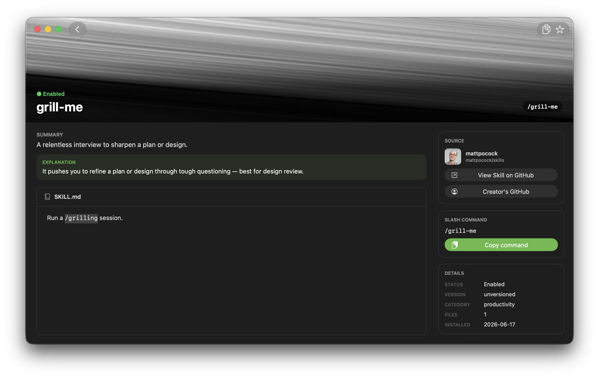

# Skelf

A tiny **native macOS menu-bar + window app** that lists your installed Claude Code skills.
Browse a grid, open a skill's detail, and **Copy** its slash-command (e.g. `/humanizer`) to
paste into cloud sessions.



SwiftUI `NavigationStack` + Liquid Glass toolbars (bridged via
`NSHostingController.sceneBridgingOptions`) hosting an AppKit grid + detail. One SwiftPM
target, split into focused files under `Sources/Skelf/`. Targets **macOS 26** (Liquid Glass);
needs **Xcode 26+** for the macOS 26 SDK and SwiftUI's macro plugin.

## Install

**Requires macOS 26 (Tahoe) or later.**

1. Download `Skelf.dmg` from the [latest release](https://github.com/devbyshima/Skelf/releases/latest).
2. Open it and drag **Skelf** onto **Applications**.
3. **First launch:** Skelf isn't yet signed with an Apple Developer ID, so macOS blocks it the
   first time. Open **System Settings → Privacy & Security**, scroll to the bottom, click
   **Open Anyway**, then confirm **Open** — you only do this once. (The old right-click → Open
   shortcut no longer works on macOS 15+.) Launch at Login works best once Skelf is in
   `/Applications`.

After that first launch, Skelf keeps itself current: it checks GitHub for a newer release on
launch and once a day, verifies the download against the published `SHA256SUMS`, and installs it
with a prompt. Run it on demand from **Check for Updates…** (app menu or the popover's ⋯), or
turn the automatic check off in **Settings ▸ Updates**.

Prefer to build it yourself? See [Build & run](#build--run) below.

## Build & run

```bash
open Package.swift              # open in Xcode and Run, or:
swift build                     # SwiftPM build
./build.sh && open Skelf.app    # bundled, ad-hoc-signed Skelf.app (icon + Info.plist)
./scripts/make-dmg.sh           # a "drag to Applications" Skelf.dmg for sharing
```

> `build.sh` produces the real `.app` and locates Xcode's SwiftUI macro plugin for plain
> `swiftc`; `swift build` / Xcode use it automatically.

## Features

- **Grid of cards** — each skill is a portrait card backed by a **unique public-domain
  painting** (Art Institute of Chicago, bundled `art-map.json`, disk-cached), with a
  generated gradient+icon fallback when offline or unmapped. Cards reflow to any width,
  scale on hover, squash on press; a click opens the detail. Resting on a card shows a
  minimal **Liquid Glass hover tip** (name, slash command, creator).
- **Auto-organized by creator** — skills group into a folder per `owner` automatically when
  that owner has ≥ 2 installed skills; singletons stay loose. Folder tiles show the
  creator's GitHub avatar. Make your own folders too (display-only — never touches Claude's
  config).
- **Favorites** — toggle from a card's ★, a ⋯ menu, or the detail; a pinned **Favorites
  folder** gathers them all.
- **Detail screen** — two columns under a painting banner: scrollable **SKILL.md** (rendered
  GitHub-style) + a sticky sidebar (Source / Slash command / Details / Actions). Click the
  banner for a **centered painting panel** (artwork + history + why it was chosen).
- **Global search** — spans **every folder and skill** (name / description / category /
  creator), **identical in the window and the menu bar**.
- **Menu-bar popover** — Liquid Glass cards for Favorites + menu-bar folders; copies `/name`
  with a toast. Toggle from anywhere with **⌥⌘S**.
- **Settings** (**⌘,** / popover ⋯ / ⚙ toolbar button) — Launch at Login, Menu Bar Only,
  Global Shortcut, Appearance (System/Light/Dark), Show Painting Covers, Refresh Painting
  Art, Reduce Motion, Play Sounds. Opens centered; persists to `UserDefaults`.
- **Menus** — Skelf / File (New Folder ⌘N, Refresh Skills ⌘R) / Edit (Undo ⌘Z, Redo ⌘⇧Z) /
  Window / Help.
- **Auto-detect** — an FSEvents watcher updates the app live as skills are added, removed,
  enabled, disabled, or edited.

## Where it reads from

Skill data is read live from disk (override the base dir with `SKILLS_DEV_DIR=…`):

| Path | Used for |
|------|----------|
| `~/Dev/.agents/skills/<id>/SKILL.md` | name, description, version, body |
| `~/Dev/.claude/skills/<id>` | symlink present ⇒ enabled |
| `~/Dev/skills-lock.json` | source repo + category |

Avatars and paintings cache under `~/Library/Caches/dev.fulltime.skelf/`; folders, favorites,
and settings persist in `UserDefaults` (`dev.fulltime.skelf`).

## CLI modes (no GUI)

```bash
./Skelf.app/Contents/MacOS/Skelf --version          # print the version and exit
./Skelf.app/Contents/MacOS/Skelf --list             # print all skills + state
./Skelf.app/Contents/MacOS/Skelf --copy <skill-id>  # put /<skill-id> on the clipboard (e.g. humanizer)
open Skelf.app --args --open <skill-id>             # launch into a skill's detail
open Skelf.app --args --enter <folder>              # launch into a folder
open Skelf.app --args --popover                     # launch with the popover open
```

## Layout

```
Package.swift               # SwiftPM target (opens in Xcode · swift build)
Sources/Skelf/
  ├── *.swift               # the app, split by concern (Skills, Art, Cards, Detail,
  │                         #   Grid, Markdown, Navigation, MenuBar, App, …)
  └── Resources/            # runtime: art-map.json · skelf.svg  (Bundle.module/Bundle.main)
Resources/                  # app-packaging: Skelf.icns · AppIcon/
build.sh                    # swiftc → Skelf.app (git-ignored build artifact)
```

See `CONTRIBUTING.md` for the per-file breakdown.

## Privacy

Skelf reads your skills from disk and contacts only three hosts, all over HTTPS: `api.artic.edu`
and `www.artic.edu` (public-domain paintings) and `github.com` (creator avatars). It sends only a
skill keyword plus standard request headers — no account, no analytics, no telemetry. Images cache
under `~/Library/Caches/dev.fulltime.skelf/`; folders, favorites, and settings live in
`UserDefaults`. Turn network art off entirely with **Settings → Show Painting Covers**.

## Credits

Made by **FullTime Studio** ([@devbyshima](https://github.com/devbyshima)). Painting imagery
courtesy of the [Art Institute of Chicago](https://www.artic.edu/), in the public domain.

## License

[MIT](LICENSE) © 2026 FullTime Studio.
